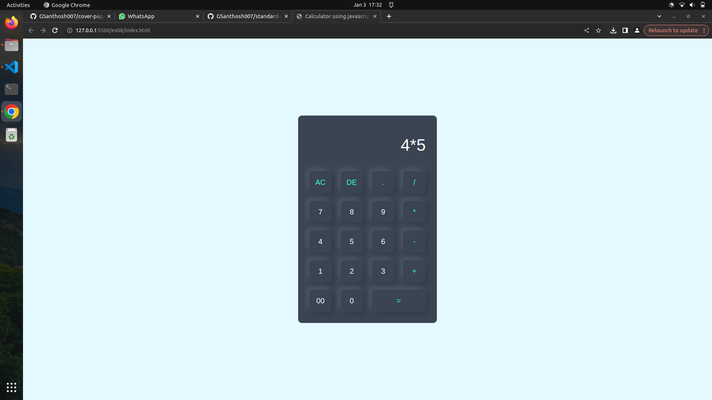

# Design of a Standard Calculator

### AIM:
To design a web application for a standard calculator.

### DESIGN STEPS:
## Step 1:
Use the code of html design the standard calculator

## Step 2:
Change the settings.py to allow the from all hosts

### Step 3:
Use the attractive colours

## Step 4:
write the different code for operators

## Step 5:
Validate the html code

## Step 6:
Validate the HTML and CSS code.

## Step 7:
Publish the website in the given URL.

## PROGRAM :
### home.html
<!DOCTYPE html>
<html>
<head>
    <meta name="viewport" content="width=device-width, initial-scale=1.0">
    <title>Calculator using javascript - Easy Tutorials</title>
    <link rel="stylesheet" href="style.css">
</head>
<body>

  

    <form>
      

        <input type="text" name="display">
      

      

        <input type="button" value="AC" onclick="display.value = '' " class="operator">
        <input type="button" value="DE" onclick="display.value =  display.value.toString().slice(0,-1)" class="operator">
        <input type="button" value="." onclick="display.value += '.' " class="operator">
        <input type="button" value="/" onclick="display.value += '/' " class="operator">
      

      

        <input type="button" value="7" onclick="display.value += '7' ">
        <input type="button" value="8" onclick="display.value += '8' ">
        <input type="button" value="9" onclick="display.value += '9' ">
        <input type="button" value="*" onclick="display.value += '*' " class="operator">
      

      

        <input type="button" value="4" onclick="display.value += '4' ">
        <input type="button" value="5" onclick="display.value += '5' ">
        <input type="button" value="6" onclick="display.value += '6' ">
        <input type="button" value="-" onclick="display.value += '-' " class="operator">
      

      

        <input type="button" value="1" onclick="display.value += '1' ">
        <input type="button" value="2" onclick="display.value += '2' ">
        <input type="button" value="3" onclick="display.value += '3' ">
        <input type="button" value="+" onclick="display.value += '+' " class="operator">
      

      

        <input type="button" value="00" onclick="display.value += '00' ">
        <input type="button" value="0" onclick="display.value += '0' ">
        <input type="button" value="=" onclick="display.value = eval(display.value)" class="equal operator">
       
      

    </form>
  

</body>
</html>

### style.css 
<!DOCTYPE html>
<html>
<head>
    <meta name="viewport" content="width=device-width, initial-scale=1.0">
    <title>Calculator using javascript - Easy Tutorials</title>
    <link rel="stylesheet" href="style.css">
</head>
<body>

  

    <form>
      

        <input type="text" name="display">
      

      

        <input type="button" value="AC" onclick="display.value = '' " class="operator">
        <input type="button" value="DE" onclick="display.value =  display.value.toString().slice(0,-1)" class="operator">
        <input type="button" value="." onclick="display.value += '.' " class="operator">
        <input type="button" value="/" onclick="display.value += '/' " class="operator">
      

      

        <input type="button" value="7" onclick="display.value += '7' ">
        <input type="button" value="8" onclick="display.value += '8' ">
        <input type="button" value="9" onclick="display.value += '9' ">
        <input type="button" value="*" onclick="display.value += '*' " class="operator">
      

      

        <input type="button" value="4" onclick="display.value += '4' ">
        <input type="button" value="5" onclick="display.value += '5' ">
        <input type="button" value="6" onclick="display.value += '6' ">
        <input type="button" value="-" onclick="display.value += '-' " class="operator">
      

      

        <input type="button" value="1" onclick="display.value += '1' ">
        <input type="button" value="2" onclick="display.value += '2' ">
        <input type="button" value="3" onclick="display.value += '3' ">
        <input type="button" value="+" onclick="display.value += '+' " class="operator">
      

      

        <input type="button" value="00" onclick="display.value += '00' ">
        <input type="button" value="0" onclick="display.value += '0' ">
        <input type="button" value="=" onclick="display.value = eval(display.value)" class="equal operator">
       
      

    </form>
  

</body>
</html>

## OUTPUT:

## Result:
This code is successfully executed 
